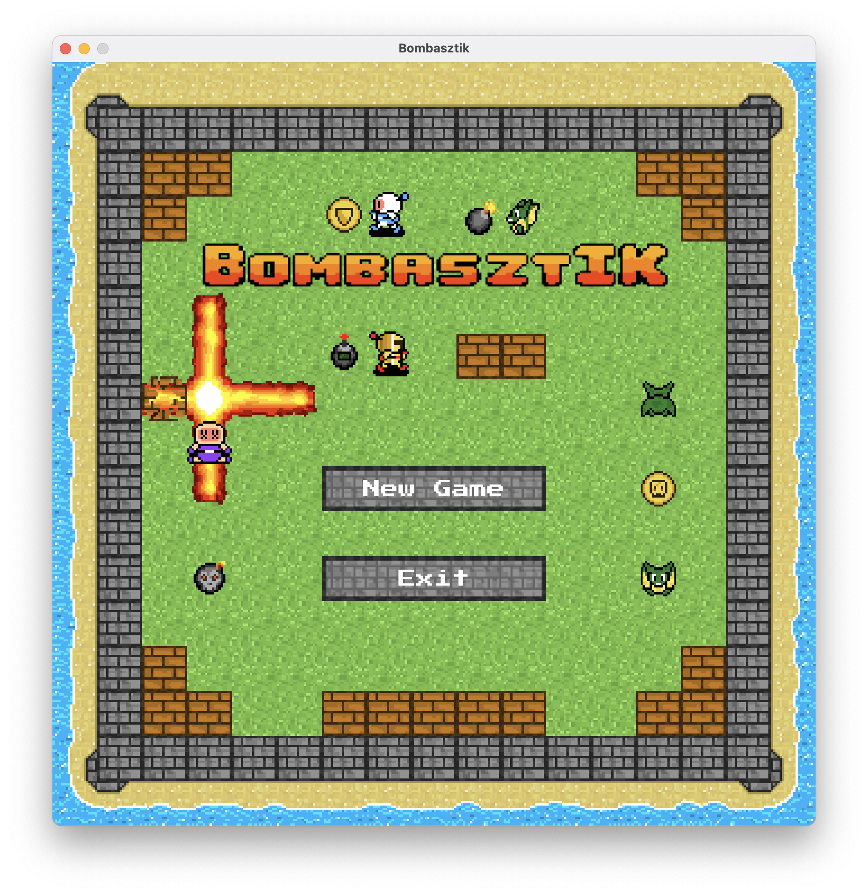
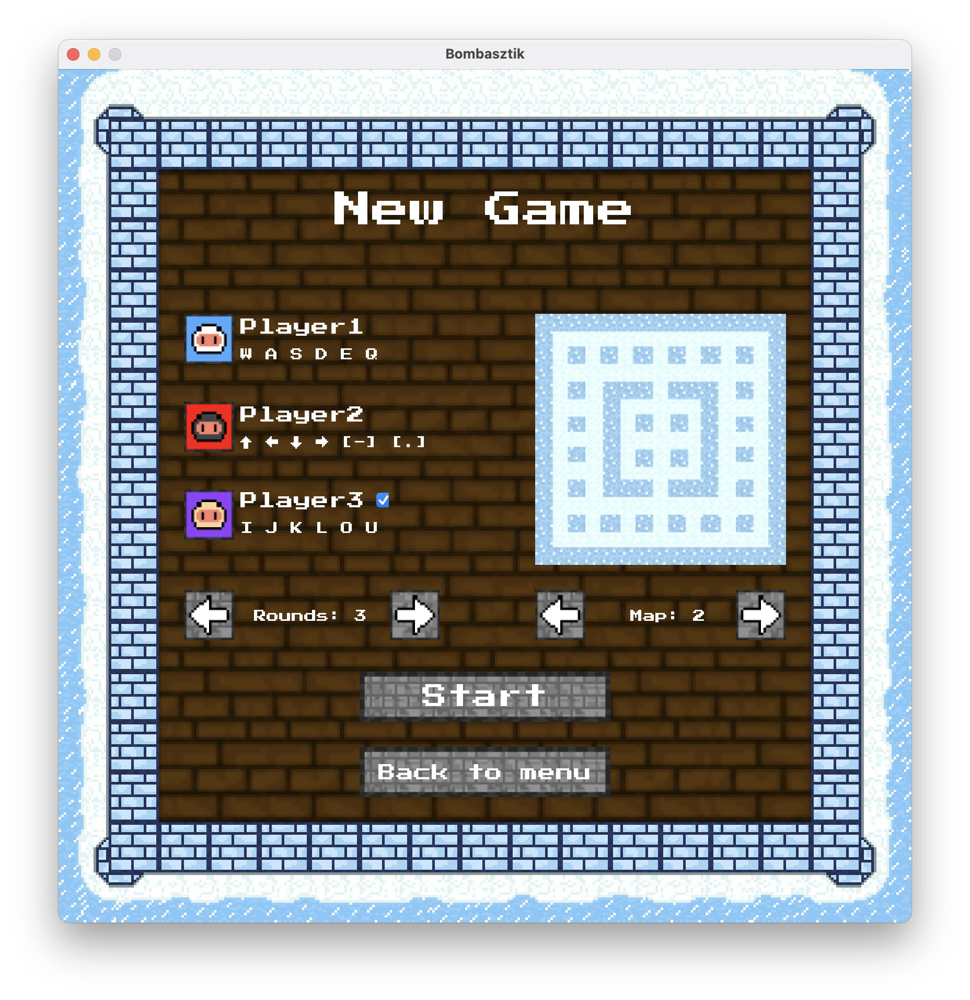
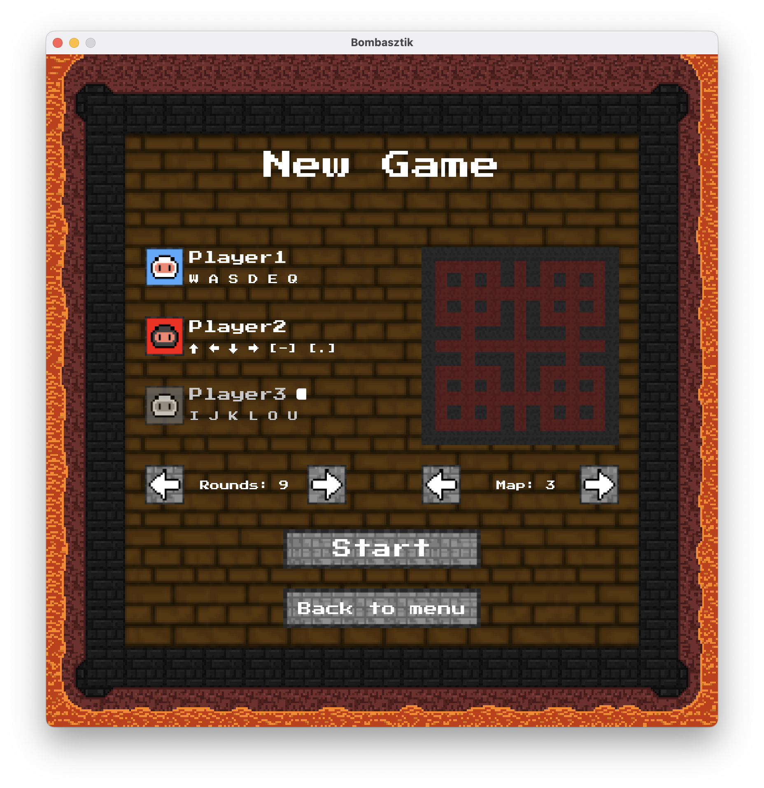
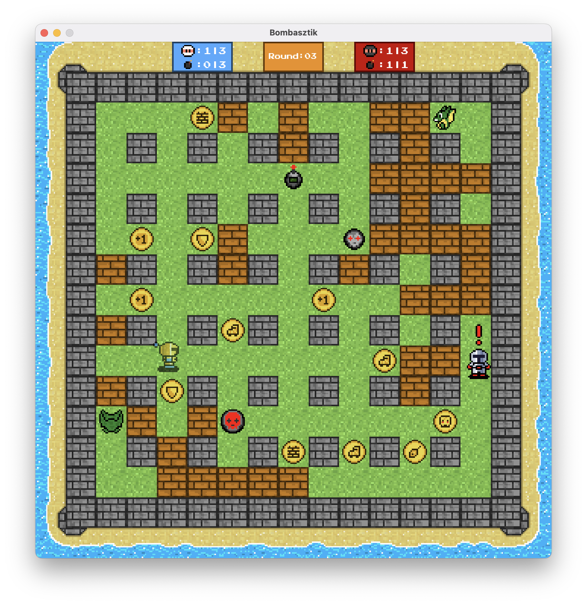
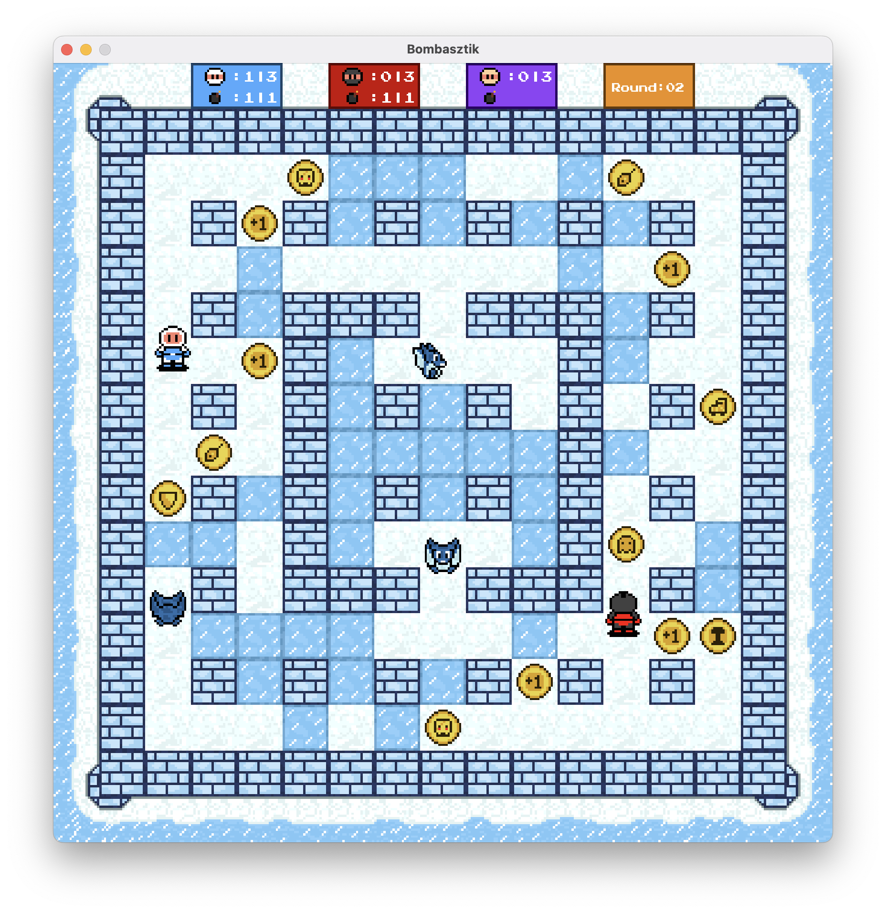
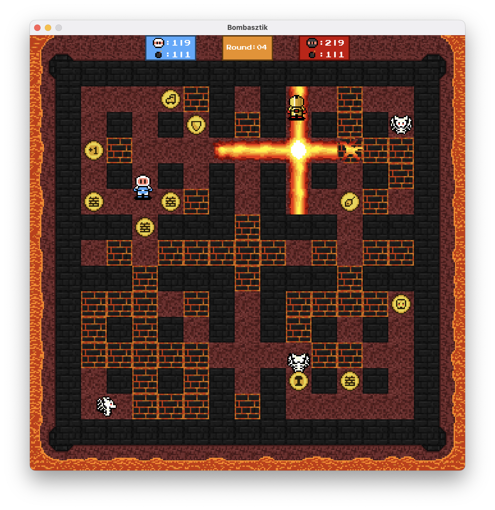
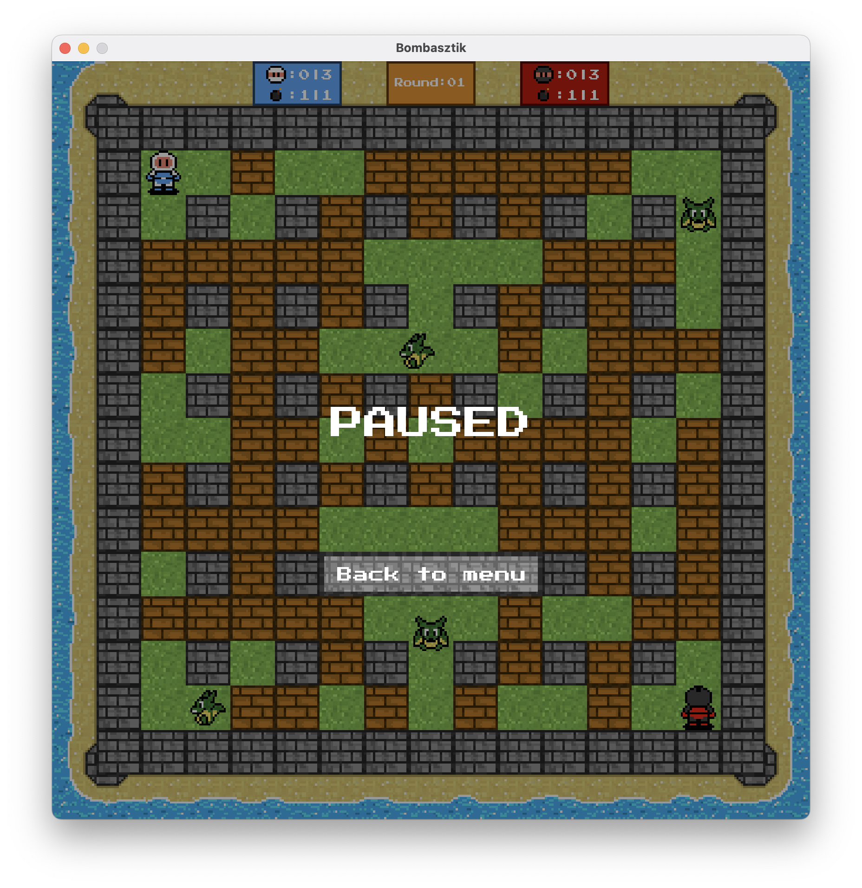
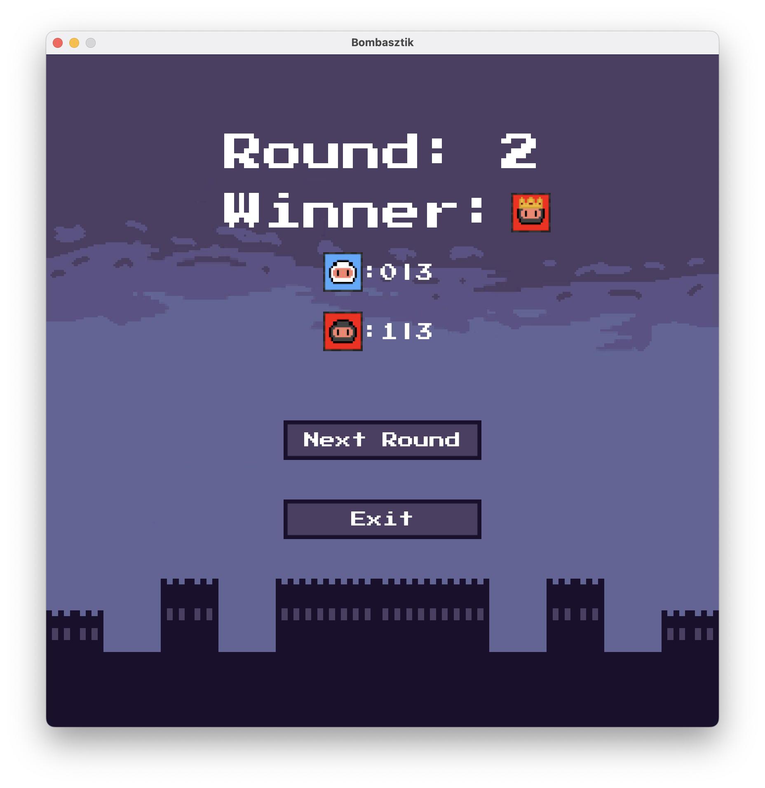
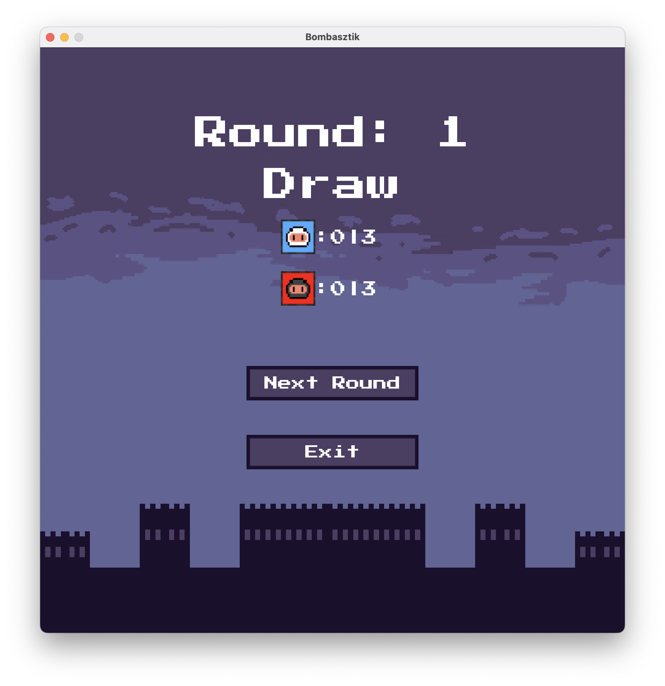
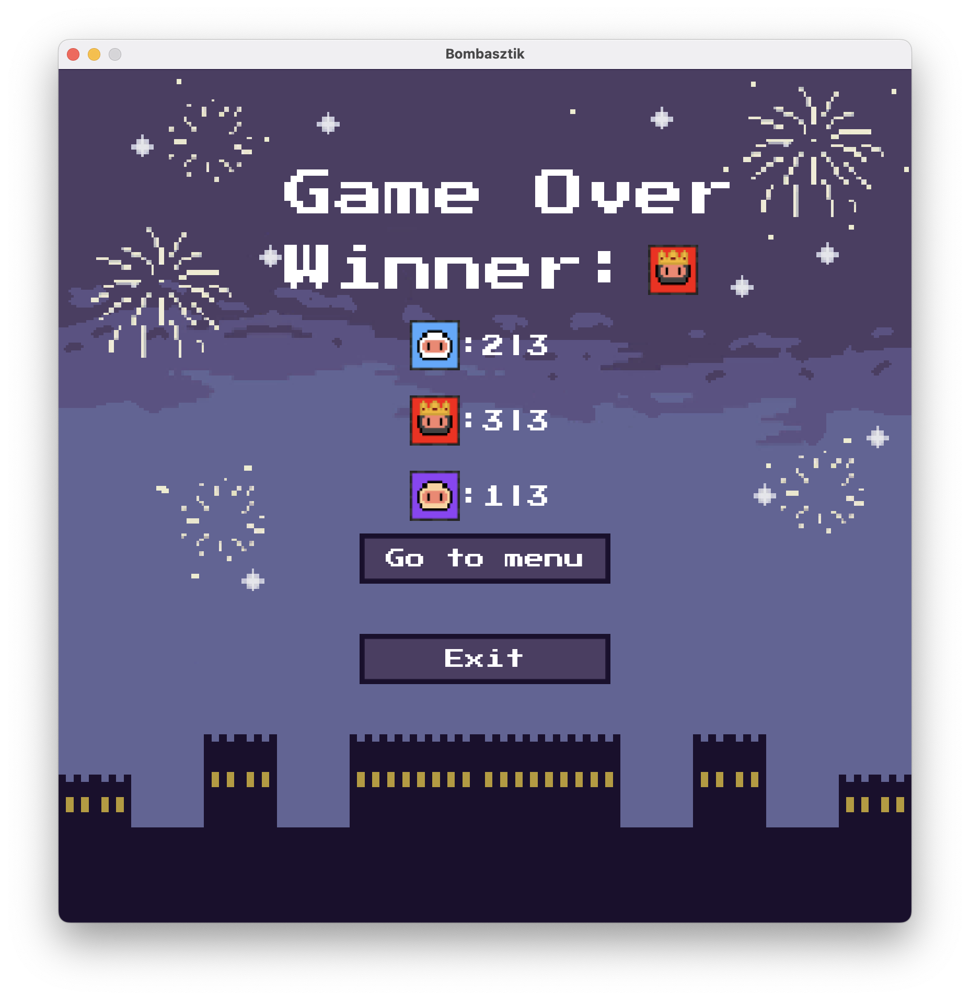

# 💣 Bomberman
A BOMBasztIK egy 2 dimenziós, felülnézetes játék, mely egy négyzet alakú pályán játszódik.  
A játékot 2 vagy 3 játékos játsza, akiknek 1-1 figurát irányítva céljuk, hogy egyedüliként maradjanak életben.  
A játékpálya mezőin fal elemek, dobozok, szörnyek és maguk a játékosok helyezkednek el.  
A játékosok bombákat lehelyezve felrobbanthatják a dobozokat, szörnyeket és a játékosokat (akár saját magukat is).  
Egy játékos veszít (és ezáltal ellenfele győz), ha felrobban, vagy ha egy szörny elkapja.
## 💣 Kiválasztott feladatok
* Alapfeladat **(2)**
* Haladó bónuszok **(1)**
* Három játékos **(1)**
*  Folyamatos mozgás **(0.5)**
* Hátráltató bónuszok **(0.5)**
* 2.5D Grafika **(0.5)**
## 💣 Bónusz feature-ök (nem volt a feladatleírás része)
* Zenék és hang effektek
* Pause screen
* Egyedi assetek
* Sprite Animációk
* Külön mező textúrák minden pályán, hozzátartozó szörnnyel.
* Külön player és bomba textúrák a poweruppokhoz.
* Corner smoothing (Ha a player neki megy egy saroknak, nem akad bele, hanem "legördül" róla.)
* Játék méretezése a felhasználó képernyő méretéhez igazítva.
## 💣 Mire van lehetőség a játékban?
**A menüben lehet:**
*  **Új játék indítása:**
	* 2 vagy 3 játékos mód kiválasztása
	*  Pálya kiválasztása
	* Körök számának kiválasztása
* **Kilépés**

**A játékos tud:**
* Mozogni (fel, le, balra, jobbra)
* Bombát lerakni
* Dobozt lerakni (lásd: bónuszok)
* Bónuszt felvenni

**A bomba:**
* 4 irányba sugarat lő ki a hatótávjának megfelelően (alapból 2)
* A dobozokat lerombolja (a robbanás a dobozon nem megy át)
* Játékosokat és szörnyeket elpusztítja 
* Hatótávjában lévő bombákat felrobbantja (nem azonnal, a távolságtól függő idő múlva)
## 💣 Milyen bónuszok vannak?
* **Több bomba:**
A játékos által lehelyezhető bombák száma 1-gyel növekszik
* **Bomba hatótáv növelés:**
 A játékos bombáinak hatótávja mind a 4 irányba 1-1 mezővel növekszik.
* **Detonátor:** 
A játékos bombái nem időzíte robbannak, hanem az utolsó lerakott bomba után újboli gombnyomásra
*  **Görkorcsolya:**
A játékos sebessége megnő a kör végéig, nem halmozható.
*  **Sérthetetlenség:**
A játékos egy bizonyos időre sérthetetlen, nem tudja se szörny se bomba elpusztítani
*  **Szellem mód:**
A játékos egy bizonyos időre át tud menni a falakon, ha a képesség lejárta után egy falban van, elpusztul.
*  **Akadály lerakás:**
A játékos bomba helyett egy dobozt rak le maga alá, ugyanúgy viselkedik mint egy sima doboz, csak bónusz nincs benne
## 💣 Mit tudnak a szörnyek?
A játékban egy típusú szörny van, ami véletlenszerűen bolyong a pályán.
Ha falnak ütközik, véletlen irányba megy tovább, ám néha teljesen véletlenszerűen is változtathat irányt,
akár 180 fokot is fordulva.
Ha a player neki megy egy szörnynek vagy fordítva, a player meghal, hacsak nem rendelkezik ezt megakadályozó bónusszal.

## 💣 Navigálás a játékban:
* **Játékos1:**
	* **W**: Fel
	* **A**:  Balra
	* **S**:  Le
	* **D**: Jobbra
	* **E** : Bomba lerakás
	* **Q** : Doboz lerakás
* **Játékos2:**
	* **↑**: Fel
	* **←**: Balra
	* **↓**: Le
	* **→**: Jobbra
	* **[-]** : Bomba lerakás
	* **[.]** : Doboz lerakás
* **Játékos3:**
	* **I**: Fel
	* **J**: Balra
	* **K**: Le
	* **L**: Jobbra
	* **O** : Bomba lerakás
	* **U** : Doboz lerakás

## 💣 Hogy néz ki a játék?

####  Bemutató videó: https://www.youtube.com/watch?v=anXkjze8GMQ

## 💣 A csapat tagjai
* **Jeges József**
* **Szegeczki Hajnalka**
* **Kovács Lóránt Zoltán**
